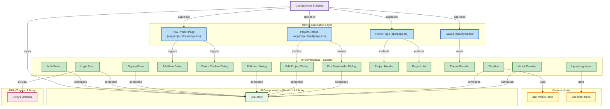

```mermaid
flowchart TD
    %% Configuration & Styling Layer
    C1["Configuration & Styling"]:::config

    %% Next.js Application Layer
    subgraph "Next.js Application Layer"
        A1["Layout (app/layout.tsx)"]:::app
        A2["Home Page (app/page.tsx)"]:::app
        A3["Project Details (app/projects/[id]/page.tsx)"]:::app
        A4["New Project Page (app/projects/new/page.tsx)"]:::app
    end

    %% UI Components – Custom Components Layer
    subgraph "UI Components – Custom"
        U1["Auth Button"]:::custom
        U2["Login Form"]:::custom
        U3["Signup Form"]:::custom
        U4["Add Item Dialog"]:::custom
        U5["Delete Confirm Dialog"]:::custom
        U6["Edit Item Dialog"]:::custom
        U7["Edit Project Dialog"]:::custom
        U8["Edit Stakeholder Dialog"]:::custom
        U9["Project Header"]:::custom
        U10["Project List"]:::custom
        U11["Theme Provider"]:::custom
        U12["Timeline"]:::custom
        U13["Upcoming Items"]:::custom
        U14["Visual Timeline"]:::custom
    end

    %% UI Components – Generic UI Library Layer
    subgraph "UI Components – Generic UI Library"
        UL["UI Library"]:::uiLibrary
    end

    %% Custom Hooks Layer
    subgraph "Custom Hooks"
        H1["use-mobile Hook"]:::hooks
        H2["use-toast Hook"]:::hooks
    end

    %% Utility/Support Library Layer
    subgraph "Utility/Support Library"
        L1["Utility Functions"]:::utils
    end

    %% Connections from Configuration to major layers
    C1 -->|"appliesTo"| A1
    C1 -->|"appliesTo"| A2
    C1 -->|"appliesTo"| A3
    C1 -->|"appliesTo"| A4
    C1 -->|"styles"| UL

    %% Connections from Next.js Application Layer to UI Custom Components
    A1 -->|"wraps"| U11
    A2 -->|"embeds"| U9
    A2 -->|"embeds"| U10
    A3 -->|"invokes"| U7
    A3 -->|"invokes"| U8
    A4 -->|"triggers"| U4
    A4 -->|"triggers"| U5

    %% Connections from UI Custom Components to UI Generic Library
    U1 -->|"composes"| UL
    U2 -->|"composes"| UL
    U3 -->|"composes"| UL
    U6 -->|"composes"| UL
    U7 -->|"composes"| UL
    U8 -->|"composes"| UL
    U12 -->|"composes"| UL
    U14 -->|"composes"| UL

    %% Connections from UI Custom Components to Custom Hooks
    U12 -->|"uses"| H1
    U13 -->|"uses"| H2

    %% Connection from a custom component to Utility Functions
    U2 -->|"utilizes"| L1

    %% Click Events for Next.js Application Layer
    click A1 "https://github.com/r-imai-tech/milestone-manage/blob/main/app/layout.tsx"
    click A2 "https://github.com/r-imai-tech/milestone-manage/blob/main/app/page.tsx"
    click A3 "https://github.com/r-imai-tech/milestone-manage/blob/main/app/projects/[id]/page.tsx"
    click A4 "https://github.com/r-imai-tech/milestone-manage/blob/main/app/projects/new/page.tsx"

    %% Click Events for UI Components – Custom
    click U1 "https://github.com/r-imai-tech/milestone-manage/blob/main/components/auth-button.tsx"
    click U2 "https://github.com/r-imai-tech/milestone-manage/blob/main/components/login-form.tsx"
    click U3 "https://github.com/r-imai-tech/milestone-manage/blob/main/components/signup-form.tsx"
    click U4 "https://github.com/r-imai-tech/milestone-manage/blob/main/components/add-item-dialog.tsx"
    click U5 "https://github.com/r-imai-tech/milestone-manage/blob/main/components/delete-confirm-dialog.tsx"
    click U6 "https://github.com/r-imai-tech/milestone-manage/blob/main/components/edit-item-dialog.tsx"
    click U7 "https://github.com/r-imai-tech/milestone-manage/blob/main/components/edit-project-dialog.tsx"
    click U8 "https://github.com/r-imai-tech/milestone-manage/blob/main/components/edit-stakeholder-dialog.tsx"
    click U9 "https://github.com/r-imai-tech/milestone-manage/blob/main/components/project-header.tsx"
    click U10 "https://github.com/r-imai-tech/milestone-manage/blob/main/components/project-list.tsx"
    click U11 "https://github.com/r-imai-tech/milestone-manage/blob/main/components/theme-provider.tsx"
    click U12 "https://github.com/r-imai-tech/milestone-manage/blob/main/components/timeline.tsx"
    click U13 "https://github.com/r-imai-tech/milestone-manage/blob/main/components/upcoming-items.tsx"
    click U14 "https://github.com/r-imai-tech/milestone-manage/blob/main/components/visual-timeline.tsx"

    %% Click Event for UI Components – Generic UI Library
    click UL "https://github.com/r-imai-tech/milestone-manage/tree/main/components/ui/"

    %% Click Events for Custom Hooks
    click H1 "https://github.com/r-imai-tech/milestone-manage/blob/main/hooks/use-mobile.tsx"
    click H2 "https://github.com/r-imai-tech/milestone-manage/blob/main/hooks/use-toast.tsx"

    %% Click Event for Utility/Support Library
    click L1 "https://github.com/r-imai-tech/milestone-manage/blob/main/lib/utils.ts"

    %% Click Event for Configuration & Styling
    click C1 "https://github.com/r-imai-tech/milestone-manage/blob/main/next.config.mjs"

    %% Styles
    classDef app fill:#bbdefb,stroke:#0d47a1,stroke-width:2px
    classDef custom fill:#c8e6c9,stroke:#2e7d32,stroke-width:2px
    classDef uiLibrary fill:#e8f5e9,stroke:#1b5e20,stroke-width:2px
    classDef hooks fill:#fff9c4,stroke:#f57f17,stroke-width:2px
    classDef utils fill:#fce4ec,stroke:#c2185b,stroke-width:2px
    classDef config fill:#ede7f6,stroke:#5e35b1,stroke-width:2px
```
